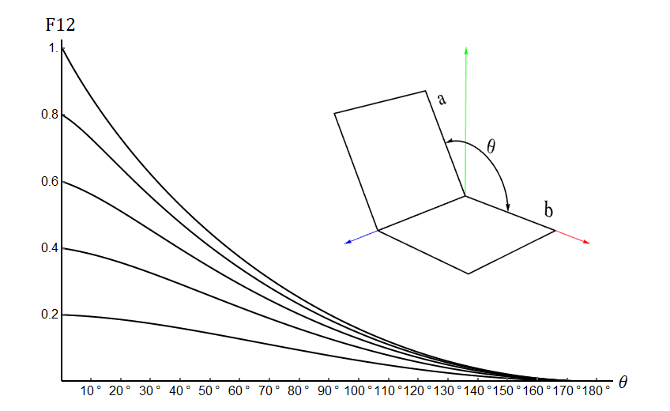

# On the Formfactor between Two Polygons

## Abstract
Form factors are used in radiosity to describe the fraction of diffusely reflected light leaving one surface and arriving at another. They are a fundamental geometric property used for computation. Many special configurations admit closed form solutions. However, the important case of the form factor between two polygons in three space has had no known closed form solution. We give such a solution for the case of general (planar, convex or concave, possibly containing holes) polygons.

## Authors
* Peter Schröder
* Pat Hanrahan

## References
 * [Caltech Multi-Res Modeling Group - Publications](http://www.multires.caltech.edu/pubs/pubs.htm)
